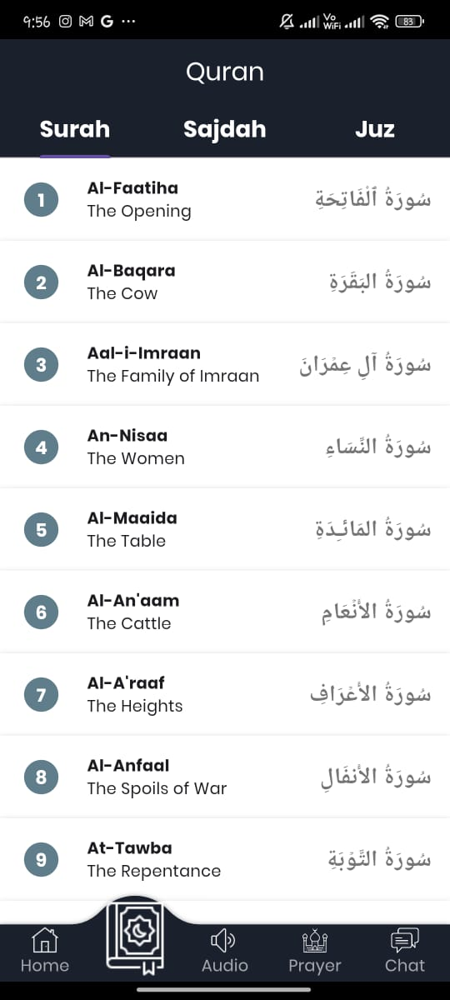
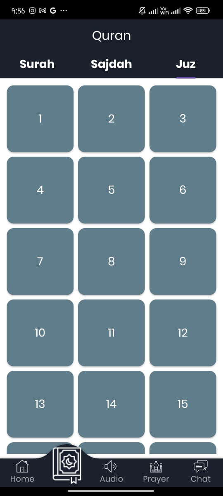
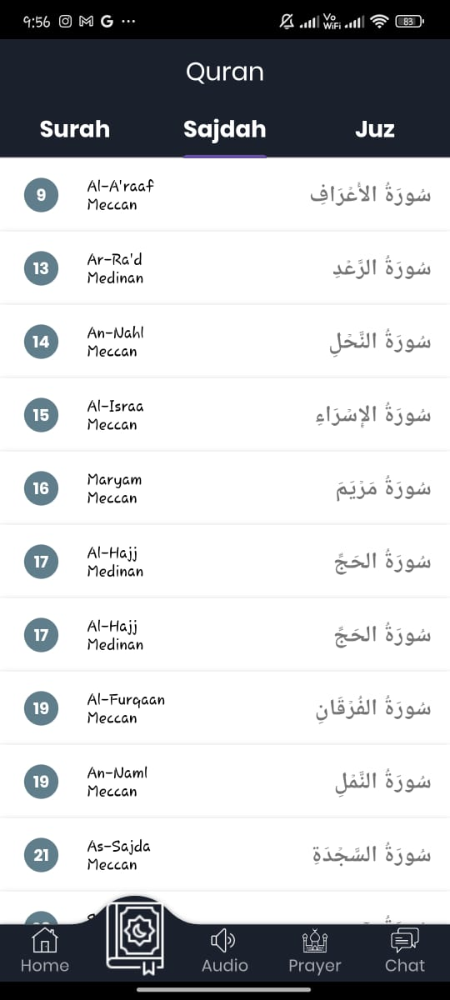
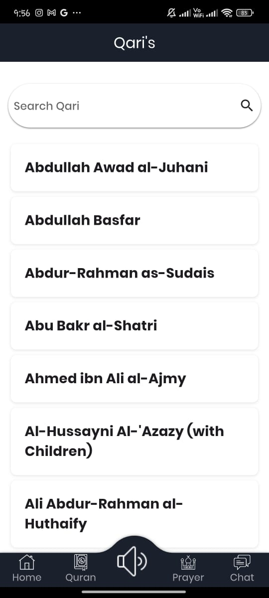
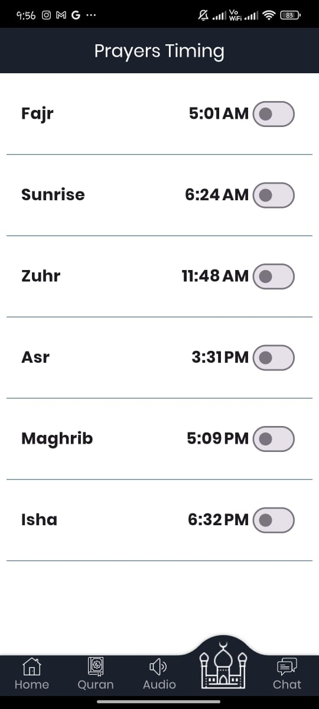
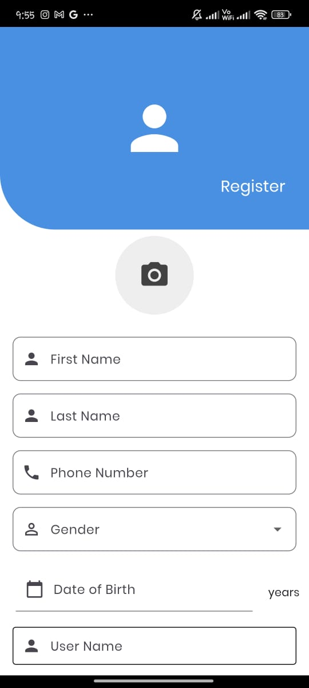
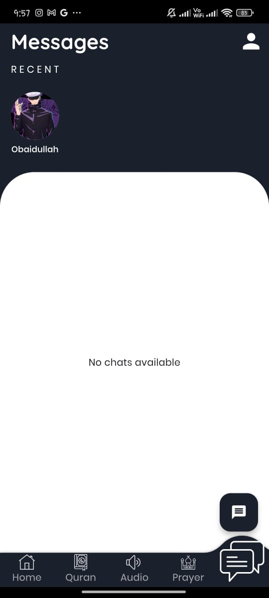
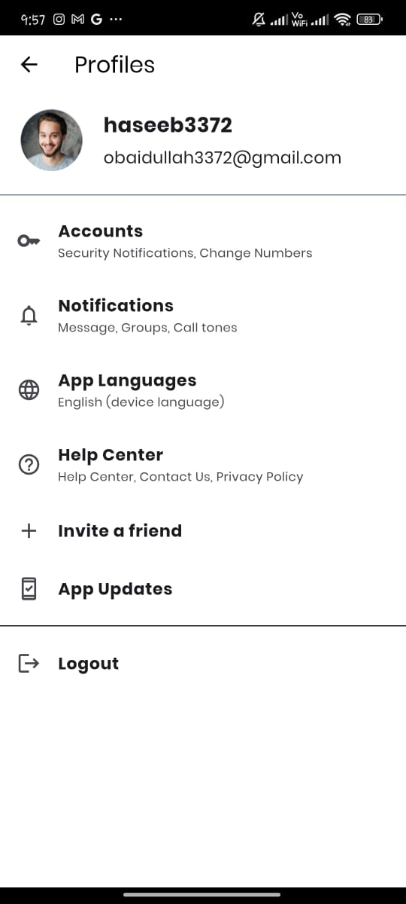

# QuranApp - Stay Connected with Faith and Friends 🌙

**QuranApp** is a comprehensive Islamic application that provides access to the Holy Quran, daily Ayah, Qari audios, and prayer timings. Additionally, the app features a **chat system** where you can connect with your friends. The app is powered by **Firebase** for chat functionality and leverages various APIs for Quran-related content.


---

## 📱 Features
- **Ayah of the Day**: Receive a new inspirational Ayah daily to boost your spiritual connection.  
  

- **Complete Quran**: Browse and read the Quran, explore **Surahs**, **Juz**, and **Sajdah**.  
    
    
  

- **Audio Recitations**: Listen to the recitations of various renowned **Qaris**.  
  

- **Prayer Timings**: Stay on top of your prayers with accurate prayer time notifications.  
  

- **User Authentication**: Secure user authentication via **Firebase**, allowing users to register and log in.  
    
  

- **Chat with Friends**: Connect with your friends, share messages, and stay in touch with your community through real-time chat.  
    
  

- **User Profiles and Contacts**: Manage your profile and keep track of your contacts within the app.  
    
  

---

## 📸 Screenshots

| Splash Screen      | Ayah of the Day    | Chat Screen       |
|-------------------|--------------------|-------------------|
|  |  |  |

| Quran Surah View    | Prayer Timings    | Qari Selection    |
|--------------------|-------------------|-------------------|
|  |  |  |

---

## 🛠️ Built With
- **Flutter**: Cross-platform mobile development framework.
- **Firebase**: For real-time chat functionality, user authentication, and cloud storage.
- **APIs**: To retrieve Quran content, Ayah of the Day, Qari audios, and prayer timings.
- **Dart**: Programming language for Flutter apps.

---

## 📂 Project Structure

```plaintext
quranapp/
│
├── lib/
│   ├── main.dart          # Entry point of the app
│   ├── screens/           # Contains all app screens (Login, Chat, Surah, etc.)
│   ├── services/          # Firebase and API services
│   ├── models/            # Data models (User, Ayah, etc.)
│   └── widgets/           # Custom UI components (Buttons, Forms, etc.)
├── assets/                # App assets (images, icons, audio)
└── pubspec.yaml           # Project dependencies
```

---

## 🚀 How to Run Locally

1. **Clone** the repository:
   ```bash
   git clone https://github.com/your-username/quranapp.git
   cd quranapp
   ```

2. **Install dependencies**:
   ```bash
   flutter pub get
   ```

3. **Set up Firebase**:
   - Follow the [Firebase Setup Guide](https://firebase.google.com/docs/flutter/setup) to configure Firebase for your app.
   - Download the `google-services.json` (Android) or `GoogleService-Info.plist` (iOS) from the Firebase Console and add it to the project.

4. **Run the app**:
   ```bash
   flutter run
   ```

---

## 🌟 Future Improvements
- **Push Notifications**: Real-time notifications for new chat messages and prayer times.
- **Multi-language Support**: Localization for multiple languages.
- **Offline Mode**: Allow Quran access and reading offline.

---

## 🤝 Contributing

We welcome contributions! Please feel free to submit a **pull request** or report issues.

---

## 🛡️ License

This project is licensed under the **MIT License** – see the [LICENSE](LICENSE) file for details.

---

## 📬 Contact

For any questions or suggestions, reach out to me:

- **GitHub**: [obaidullah72](https://github.com/obaidullah72/)
- **LinkedIn**: [obaidullah72](https://www.linkedin.com/in/obaidullah72/)

---

[](https://visitcount.itsvg.in)
